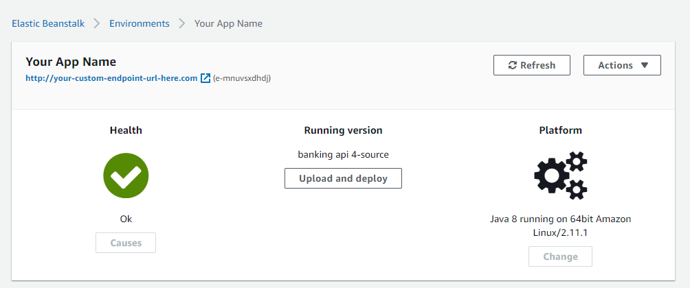

# AWS AMAZON WEB DEPLOYMENT

### Created by Dean Alam

This tutorial caters to Windows users, but many steps apply to any OS.

1. Make an AWS account, for students you have to apply and be approved with your school (WilmU) email.
For the normal account, you need to put in payment information. (https://aws.amazon.com/)

2. After you signed up, in your AWS Management Console you need to click on ``Elastic Beanstalk`` from the list of
services.  


3. Click on ``Create Application``.  


3. Fill in the information such as the Application Name. When you scroll down to ``Platform``, 
 we select ``Java`` and in this case we are using ``Java 8 running on 64bit Amazon Linux``.  
 

4. Now take a step back and go back to IntelliJ or your IDE. Add a main class manifest (define your main for the jar file) using a plugin in your pom.xml file like this:
**Make sure you replace the (yourpackagename.YourClassName) area with the class that
has your MAIN method**.

    ``` 
    <plugin>
         <!-- Build an executable JAR -->
         <groupId>org.apache.maven.plugins</groupId>
         <artifactId>maven-jar-plugin</artifactId>
         <version>3.2.0</version>
         <configuration>
           <archive>
             <manifest>
               <addClasspath>true</addClasspath>
               <classpathPrefix>lib/</classpathPrefix>
               <mainClass>com.yourpackagename.YourClassName</mainClass>
             </manifest>
           </archive>
         </configuration>
       </plugin>
    ```
5. In our IntelliJ application, we are configuring it so that it runs with a built-in Amazon MySQL database.
To do this we need to add the MySQL Dependency to our pom.xml.
    ```
        <dependency>
			<groupId>mysql</groupId>
			<artifactId>mysql-connector-java</artifactId>
			<scope>runtime</scope>
		 </dependency>
    ```
6. In our ``resources/application.properties`` file, we need to configure our database for the placeholder
Amazon database and set the port to 5000. It's okay to have more stuff in your ``application.properties``,
but you at least need these lines. Do not fill in the ${RDS} tagged things, leave them
exactly as they are.

    ```
    spring.datasource.url=jdbc:mysql://${RDS_HOSTNAME}:${RDS_PORT}/${RDS_DB_NAME}
    spring.datasource.username=${RDS_USERNAME}
    spring.datasource.password=${RDS_PASSWORD}
    spring.jpa.hibernate.ddl-auto=create
    server.port=5000
    ```

7. We need to generate a runnable ``.jar`` file of our project. To do that you need to run ``mvn package -DskipTests``
in your terminal and it will generate a jar file of our project in our projects ``target`` folder.  
(If you don't have mvn commands in your terminal, you need to install them, the download is here: https://maven.apache.org/download.cgi)  
   
(Maven Windows commands installation tutorial: https://mkyong.com/maven/how-to-install-maven-in-windows/)  
*(If you're on Mac, ask Corey.)*

8. Back on the Amazon page, under the ``Application Code`` section, check the box for ``Upload your code``, check ``Local File`` and browse
your computer for the ``.jar`` file you generated. You will upload it here.
     
   
9. Next, click on ``Configure more options``.
     
10. Click ``Edit`` on the Software box.
    
10. Scroll down to the ``Environment Properties`` box, and we are gonna add a new field with the name ``SERVER_PORT``
and value ``5000`` and then click ``Save``.

11. Now because we want to use a built in Amazon MySQL Database, we need to go down to the box that says Database and click 
``Edit``.

12. Here, we set the ``Engine`` to ``mysql``, and we need to set a ``Username`` and ``Password`` for the database. Amazon will
automatically fill this into our ``application.properties`` ``${RDS}`` tags for us when it runs. We set ``Retention`` to
``Delete`` because we don't care about saving this database upon deletion of the application. In the real world, you may
not want to do this. 

13. Scroll down and hit ``Save``. When you are in the configuration menu again you can scroll all the way down and click on
``Create app``

14. Now AWS will try to build and deploy your application. A console log will come up and the whole process will take some
time, probably over 10 minutes so go grab some coffee or wings or something.
15. Once it's finished, you should be redirected to the App page where it will show you the ``Health`` of the app and your
Cloud endpoint. Hopefully the Health has a green checkmark and your application is working!



More Helpful links:  
https://youtu.be/6SadWaJrtnY  
https://youtu.be/EtDSJRdpJM4
